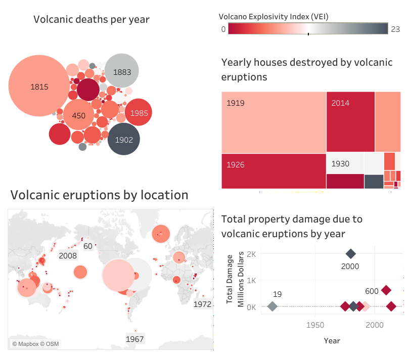
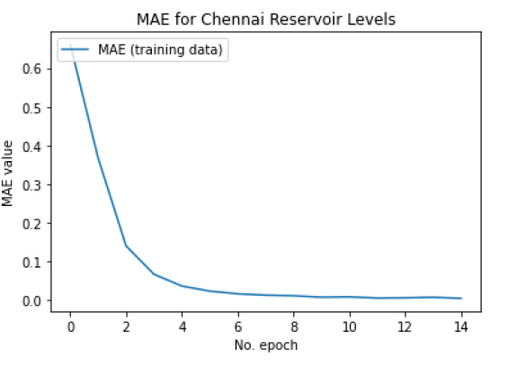

# Anthony's Data Analysis Portfolio
## By Anthony Marcolongo

### [Project 1](https://github.com/amarcolongo/Capstone): Can we predict bitcoin price based off daily volume traded?
#### Description: This was my graduate capstone project.
#### The purpose of this project was to use both linear regression and logistic regression to determine if there is a link between daily price and volume traded.

#### fig 1: Graph of Volume Traded versus Closing Price

#### fig 2: Graph of log(Volume Traded) versus Closing Price

### [Project 2](https://github.com/amarcolongo/Volcano): A Tableau Dashboard Analyzing the Effect of Volcanos on Humans.
#### Description: This was a project that I put together for practice creating Tableau Dashboards.
#### The purpose of this project was to gain experience with Tableau.

#### fig 3: Tableau Dashboard

### [Project 3](https://github.com/amarcolongo/D213-Task-2): Natural Language Processing with TensorFlow 2.0.
#### Description: NLP was used to predict if an Amazon user review would be classified as either positive, or negative. 
#### Th purpose of this project was to gain familiarity with NLP in Tensorflow 2.0.

#### fig 4: Mean Absolute Error by # of Epochs

